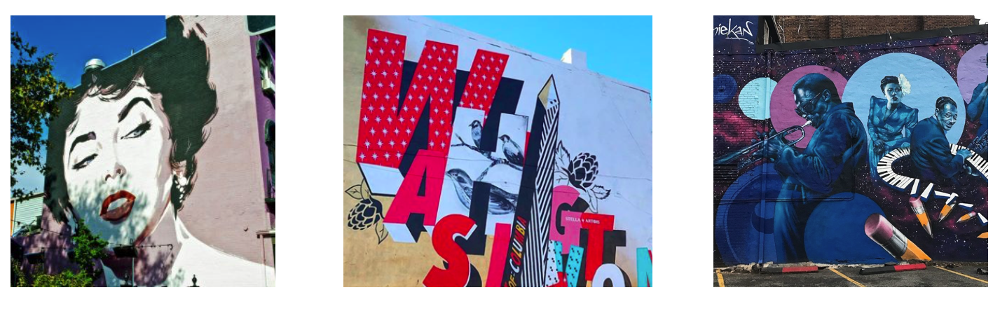

A bit of DC street art by, various artists | <a href="../about#whats-with-the-random-art">What's with the random art?</a>

In this episode of Cloud Chat I am joined by Mario Loriedo who is a Sr. Principle Software Engineer at Red Hat. During our conversation we get an update on Eclipse Che, the state of cloud developer environments, and enterprise adoption. Finally, we end our session talking about some of the ins and outs of leading an open source project like Eclipse Che like working with enterprises, building community, and how to keep your open source project growing. 

Enjoy, and subscribe to the <a href="https://www.twitch.tv/cloudchat_">Eclipse Foundation Cloud Chat Twitch channel!</a>

<!-- Add a placeholder for the Twitch embed -->

<!-- Load the Twitch embed script -->

<!-- Create a Twitch.Player object. This will render within the placeholder div -->

